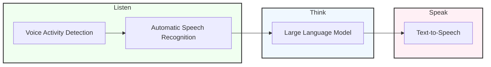

# cachai: el LLM multimodal del que no hay nada que decir

## Traditional Voice AI

The process is divided into three main stages: Listen, Think, and Speak. Each stage involves specific AI technologies to process and generate speech.

## Listen Stage

- **Voice Activity Detection:** Identifies when speech is present in the audio input.
- **Automatic Speech Recognition:** Converts the detected speech into text.

## Think Stage

- **Large Language Model:** Processes the text input and generates an appropriate response.

## Speak Stage

- **Text-to-Speech:** Converts the generated text response into spoken audio output.

The entire process typically takes 3 to 5 seconds from input to output.