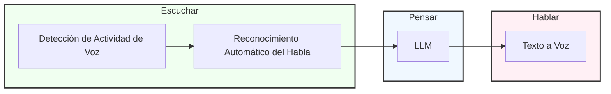

# cachai: el LLM multimodal del que no hay nada que decir

## IA de Voz Tradicional

El proceso se divide en tres etapas principales: Escuchar, Pensar y Hablar. Cada etapa involucra tecnologías específicas de IA para procesar y generar voz.

### Etapa de Escuchar

- **Detección de Actividad de Voz:** Identifica cuándo hay habla presente en la entrada de audio.
- **Reconocimiento Automático del Habla:** Convierte el habla detectada en texto.

### Etapa de Pensar

- **LLM:** Procesa la entrada de texto y genera una respuesta apropiada.

### Etapa de Hablar

- **Texto a Voz:** Convierte la respuesta de texto generada en salida de audio hablada.

Todo el proceso típicamente toma de 3 a 5 segundos desde la entrada hasta la salida.