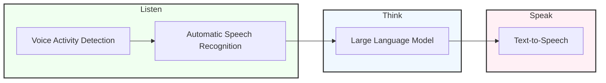
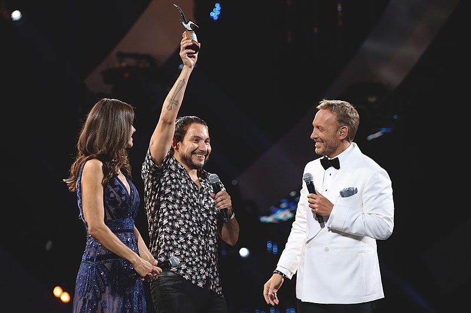

# cachai: the multimodal LLM about which there's nothing to say

Welcome to the multimodal LLM that brings Chile's vibrant linguistic landscape to the forefront of technology. We're not just translating words; we're capturing the culture, humor, and unmistakable Chilean spirit.

The future of AI is speaking Chilean, cachai?

## Motivation

Generative AI is revolutionizing global communication, with the potential to mediate all our interactions in the near future. However, [current models predominantly excel in standard English](https://blog.modernmt.com/making-generative-ai-multilingual-at-scale/), leaving less-represented languages and dialects at a significant disadvantage. This disparity is particularly evident in the case of **Chilean Spanish**, a dialect so unique that it challenges the very notion of what constitutes Spanish.

The Spanish spoken in Chile [stands out as one of the most linguistically disruptive variants worldwide](https://www.elmundo.es/cultura/2021/11/30/61a4a36321efa013518b4571.html). Its distinctiveness is unmistakable to both native speakers and language experts, although it is difficult to quantify. The Chilean dialect is characterized by:

- Rapid evolution of spoken and written language
- Frequent invention and adoption of new words
- Flexible and often unconventional pronunciation
- Constant modification and reinterpretation of linguistic rules

These factors combine to create a language environment where *"speaking Chilean"* diverges significantly from standard Spanish, posing unique challenges for LLMs.

The legendary filmmaker [Raúl Ruiz](https://www.ojoentinta.com/chile-segun-raul-ruiz/) eloquently captures the complexity of Chilean Spanish:

>What I like about Chile is that special way Chileans have of speaking. Chileans are sometimes capable of speaking without using either verb or subject, or they use verbs and the subject displaced, which makes them talk for hours and you don't know what about. Every Chilean speaks exclusively in quotation marks. It's someone who puts rhetoric before reality. Chile manufactures a very curious form of artificial language in which intonation is almost as important as the words that are uttered. More than the accent, it's the strange syntax. One starts a sentence and ends with ellipsis, starts another and another, and what happens is that people are speaking with three parallel discourses.

|  | 
|:--:| 
| *"Tres tristes tigres", a masterpiece by Raúl Ruiz* |

Adapting models to this Chilean dialect requires more than simple translation. It demands a deep understanding of the cultural context, linguistic nuances, and the ever-evolving nature of the language. To achieve this, we need to curate a reliable written record that captures the essence of Chilean Spanish, reflecting its evolution while ensuring quality and representativeness.

Developing a model specialized in Chilean Spanish is not just about preserving linguistic diversity. It's about ensuring that as AI-mediated communication becomes ubiquitous, Chilean voices are not left behind. This project aims to bridge the gap between global advancements and local linguistic realities. The goal is to create a LLM that can authentically understand and interact with Chilean Spanish speakers, reflecting their unique expressions and cultural context.

## Exploration

### Traditional Voice AI

The process is divided into three main stages: Listen, Think, and Speak. Each stage involves specific AI technologies to process and generate speech.

#### Listen Stage

- **Voice Activity Detection:** Identifies when speech is present in the audio input.
- **Automatic Speech Recognition:** Converts the detected speech into text.

#### Think Stage

- **Large Language Model:** Processes the text input and generates an appropriate response.

#### Speak Stage

- **Text-to-Speech:** Converts the generated text response into spoken audio output.

The entire process typically takes 3 to 5 seconds from input to output.

## Data

### Chilean Humor

|  | 
|:--:| 
| *Felipe Avello in the Viña del Mar Festival. SA Producciones, [CC BY-SA 4.0](https://creativecommons.org/licenses/by-sa/4.0), via Wikimedia Commons* |

An unexpected but rich source for this linguistic data lies in Chile's vibrant comedy scene. The [Viña del Mar Festival](https://en.wikipedia.org/wiki/Vi%C3%B1a_del_Mar_International_Song_Festival), showcases the country's top comedians and offers a treasure trove of uniquely Chilean expressions, wordplay, and cultural references. Held annually since 1960, the festival presents Chilean humor, known for its eccentricity – from talking puppets to trampoline-jumping comedians. This humor often features dialogues that are incomprehensible to non-Chilean Spanish speakers, making it an ideal dataset for training LLMs in the intricacies of Chilean Spanish.
